# Computer_Vision_TIL

> ## 딥러닝 기초 (간단 정리)

***

>### 퍼셉트론
- 다수의 신호를 입력으로 받아 하나의 신호를 출력, 1 또는 0 이라는 정보를 앞으로 전달
- 퍼셉트론은 이진 분류(Binary Classification) 모델을 학습하기 위한 지도학습(Supervised Learning) 기반의 알고리즘
- 퍼셉트론의 종류는 입력층(Input Layer)과 출력층(Output Layer) 사이에 은닉층(Hidden Layer)의 존재 여부에 따라 단층(Single-Layer) 퍼셉트론과 다층(Multi-Layer) 퍼셉트론으로 나뉨

  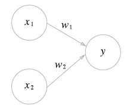

- x1과 x2는 입력 신호, y는 출력 신호, w1과 w2는 weight를 의미
- 원을 뉴런 or 노드
- 입력 신호가 노드에 보내질 때 고유한 가중치가 곱해짐 (w1x1,w2x2)
- 신호의 총합이 임계값 넘을 때만 1을 출력

  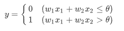

***

>### Multi-Layer Perceptron (다층 퍼셉트론)

- 입력층과 출력층 사이에 1개 이상의 은닝층이 있는 경우를 다층 퍼셉트론(Multi-Layer Perceptron, MLP)이라 부름

  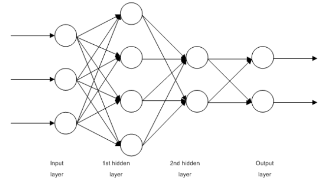

- 2개 이상의 은닉층을 가진 다층 퍼셉트론을 심층신경망(Deep Neural Network, DNN)이라 부릅

***

>### Activation Function

-  퍼셉트론(Perceptron)의 출력값을 결정하는 비선형(non-linear) 함수

  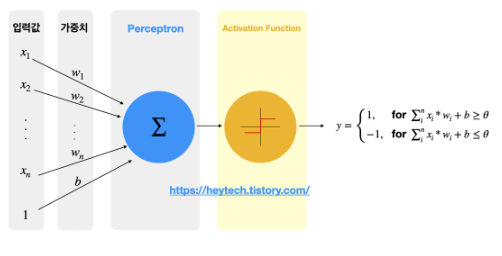

***

>### Activation Function Type

#### Sign Function
- Sign 함수의 활성화 함수는 퍼셉트론 내 입력값의 총합이 0보다 작을 경우 -1을 출력하고, 0보다 클 경우 1을 출력하는 역할

  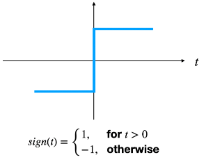

- Sign 함수는 데이터와 결정경계(Decision Boundary) 간 거리 정보를 고려하지 않는 한계가 존재함

  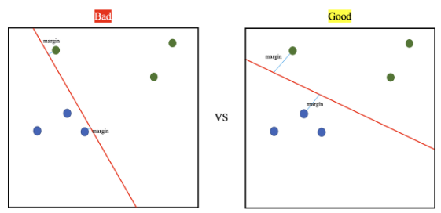

- 경계선과 데이터와의 거리(margin)이 클수록 좋은 결정 경계

#### Sigmoid Function

  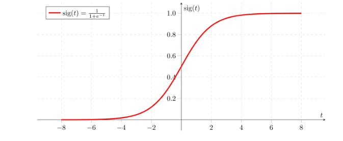

- Sigmoid 함수의 특징
  - 모든 입력값에 대해 출력값이 실수값으로 정의 (Soft Decision)
  - 값이 작아질수록 0, 커질수록 1에 수렴
  - 출력이 0~1 사이로 확률 표현 가능(Binary Classification)
  - **Vanashing Gradient** 문제 존재

- Sigmoid 수식

  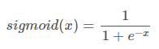

#### Tanh Function

- 하이퍼볼릭 탄젠트(Hyperbolic Tangent) 함수

  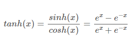

- Tanh 함수 시각화 및 특징
  - 모든 입력값에 대해 출력값이 실숫값으로 정의(=Soft Decision)
  - 값이 작아질수록 -1, 커질수록 1에 수렴
  - 입력값이 0에 가까울수록 미분이 크기 때문에 출력값이 빠르게 변함
  - **Vanashing Gradient** 문제 존재

  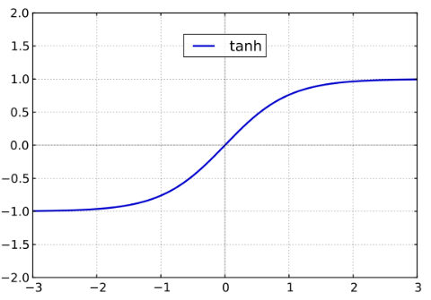

#### Softmax Function

 - Softmax 함수는 N가지 출력값을 갖는 함수로써 입력값을 N가지 클래스 중 하나로 분류하는 Multi-class Classification에 주로 사용

  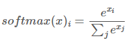

- Softmax 함수 시각화 및 특징
  - 출력값이 N개
  - 입력값을 각각 지수함수로 취하고, 이를 정규화(=총합을 1로 만듦)
  - 정규화로 인해 각 출력값은 0~1 값을 가짐
  - 모든 출력값의 합은 반드시 1
  - Multi-class Classfication

  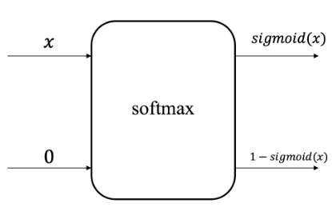

  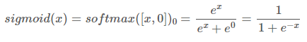

#### ReLU Function

- ReLU(Rectified Linear Unit, ReLU) 함수는 y = x 인 선형함수가 입력값 0 이라에서부터 rectified(정류)된 함수

  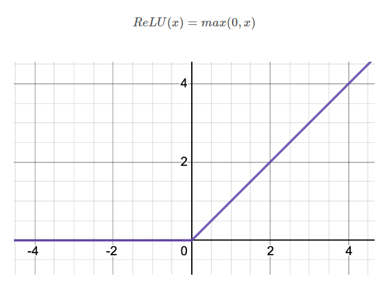

- ReLU 함수 특징
  - 딥러닝 분야에서 가장 많이 사용되는 활성화 함수
  - Sigmoid, tanh 함수의 Vanashing Gradient 문제 해결
  - 입력값이 음수일 경우 출력값과 미분값을 모두 0으로 강제하므로 죽은 뉴런을 회생하는 데 어려움 존재
  - 구현이 단순하고 연산이 필요 없이 임계값(양수/음수 여부)만 활용하므로 연산 속도 빠름