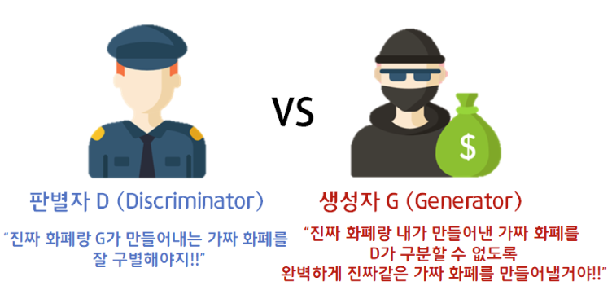

# GAN 기초

>### Abstarct

- Generative model과 Discriminative model 총 2개의 모델 학습.
- "경쟁" 과정을 통해 Generative model을 추정하는 새로운 프레임워크 제안.
- Neural Network로 이루어진 생성자(Generator)와 판별자(Discriminator)가 서로 겨루며 훈련.

- #### Generative model and Discriminative model
    - **Generative model(생성 모델, G)**
    - Discriminative model이 구별하지 못하도록 Training data의 분포를 모사함.
    - Unsupervied Learning(비지도 학습)
     
      
      
    - **Discriminative model(판별 모델, D)**
    - Sample data가 G(Generative model)로부터 나온 데이터가 아닌, 실제 Training data로부터 나온 데이터일 확률 추정.
    - Supervied Learning(지도 학습)