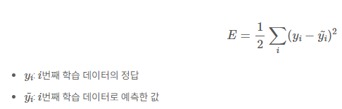
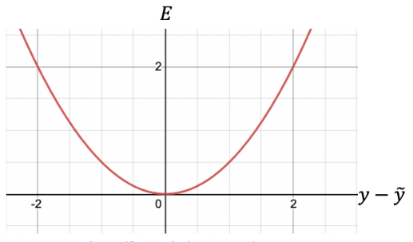
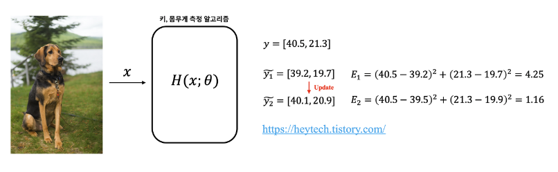
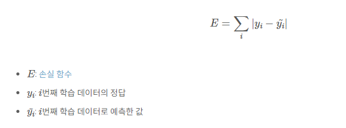
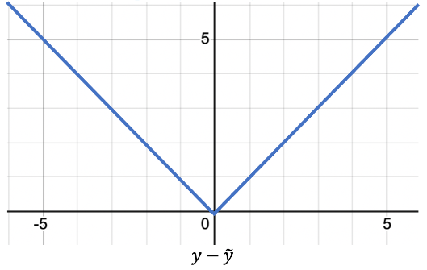
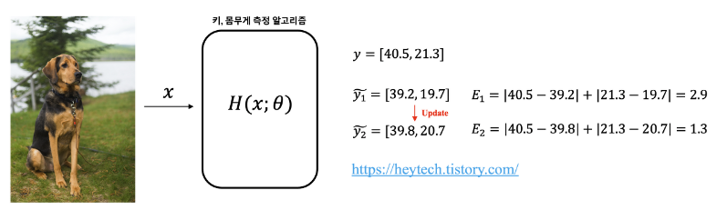

># Loss Function

***
### MSE

- 평균제곱오차(Mean Squared Error, MSE)는 이름에서 알 수 있듯이 오차(error)를 제곱한 값의 평균
- 오차란 알고리즘이 예측한 값과 실제 정답과의 차이
- MSE 값은 **작을수록** 알고리즘의 성능이 좋다



### Feature

1. #### 오차 대비 큰 손실 함수의 증가폭
    - MSE는 오차가 커질수록 손실 함수 값이 빠르게 증가하는 특징
    - 평균절대오차(MAE)는 오차가 커질수록 손실 함수가 선형적으로 증가 (손실과 비례)
    - 평균제곱오차

        

2. #### 회귀의 활용

    ```
     EX. 
     실제 키와, 무게 [40.5, 21.3]
     예측 키와, 무게 [39.2, 19.7]
     MSE => 4.25
     다음 예측 " [40.1, 20.9]
     MSE => 1.16

    ```

    

***
### MAE

- 평균절대오차(Mean Absolute Error, MAE)는 모든 절대 오차(Error)의 평균
- 정답을 잘 맞힐수록 MSE 값은 작고, MAE가 작을수록 알고리즘의 성능이 좋다고 볼 수 있음

    

### Feature

1. #### 오차와 비례하는 손실 함수

    
    - MAE는 손실 함수가 오차와 비례하여 일정하게 증가하는 특징
    - MAE와 달리, 평균제곱오차(MSE)는 오차 제곱의 평균값이므로 오차가 커질수록 손실 함수의 값이 빠르게 증가한다는 특징

2. #### 회귀 문제에 활용

    