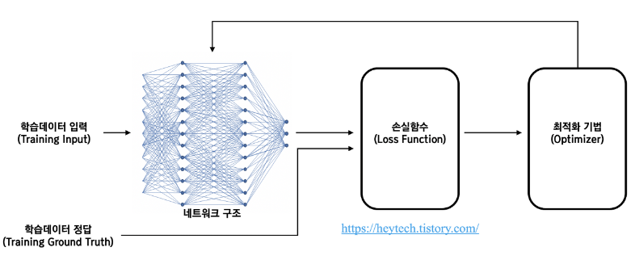
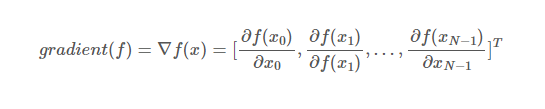

># Optimization

***
### 1. 최적화 개념
- 딥러닝 분야에서 최적화(Optimization)란 손실 함수(Loss Function) 값을 최소화하는 파라미터를 구하는 과정

### 2. 기울기 개념

### 3. Gradient Descent

- 경사 하강법(Gradient Descent)이란 딥러닝 알고리즘 학습 시 사용되는 최적화 방법