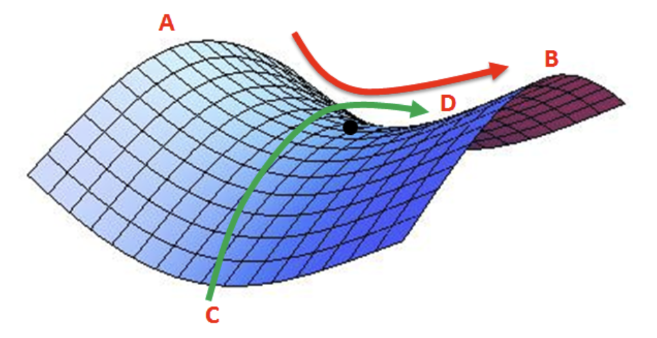

># Optimization

***
### 1. 최적화 개념
- 딥러닝 분야에서 최적화(Optimization)란 손실 함수(Loss Function) 값을 최소화하는 파라미터를 구하는 과정

### 2. 기울기 개념

### 3. Gradient Descent

- 경사 하강법(Gradient Descent)이란 딥러닝 알고리즘 학습 시 사용되는 최적화 방법
- 러닝 알고리즘 학습 시 목표는 예측값과 정답값 간의 차이인 손실 함수의 크기를 최소화시키는 파라미터를 찾는 것

- 수식

- 손실 함수 그래프에서 값이 가장 낮은 지점으로(=손실 함수의 최솟값) 경사를 타고 하강하는 기법을 경사 하강법

- learning rate: 학습률이란 어떤 비율만큼 파라미터를 업데이트할지를 결정하는 값으로 
과 사이의 값을 가지며, 사용자가 직접 설정해야 하는 하이퍼파라미터(hyper-parameter)

### 4. 경사 하강법의 한계

- 첫째, Local Minimum에 빠지기 쉽다는 점
- 둘째, 안장점(Saddle point)을 벗어나지 못한다는 점

#### 4.1 Local Minimum
 - 경사 하강법은 비볼록 함수의 경우, 파라미터의 초기 시작 위치에 따라 최적의 값이 달라진다는 한계
 
 - 함수의 형태는 크게 볼록 함수(Convex function)와 비 볼록 함수(Non-convex function)

 - 볼록 함수

 

 - 비볼록 함수에서의 문제
 - 경사 하강법 사용 시 파라미터 값의 시작 위치에 따라 최적의 값이 달라진다는 한계

 

 - Global Minimum은 목표 함수 그래프 전체를 고려했을 때 최솟값을 의미하고, Local minimum은 그래프 내 일부만 고려했을 때 최솟값을 의미

 - 경사 하강법으로 최적의 값인 줄 알았던 값이 Global minimum보다 큰 경우를 Local minimum

#### 4.2. Saddle Point 문제

- 안장점(Saddle Point)을 벗어나지 못함

