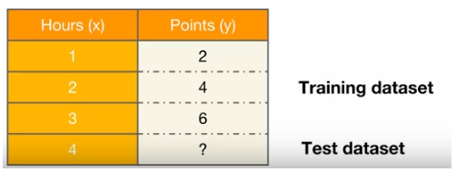
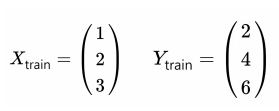
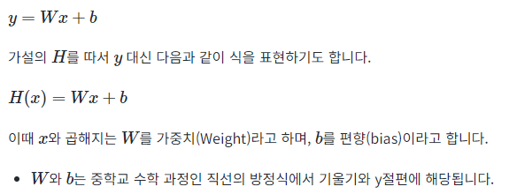
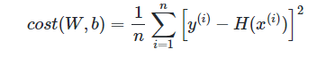

># Linear Regression

***
### Data Definition
- 학습할 데이터에 대해서 알아봅니다.

### Hypothesis 
- 가설을 수립하는 방법에 대해서 알아봅니다.

### Compute loss
- 학습 데이터를 이용해서 연속적으로 모델을 개선시키는데 이 때 손실(loss)를 이용합니다.

### Gradient Descent
- 학습을 위한 핵심 알고리즘인 경사 하강법(Gradient Descent)에 대해서 이해합니다.


>## 1. Data Definition




-  예측을 위해 사용하는 데이터를 훈련 데이터셋(training dataset)이라고 합니다. 학습이 끝난 후, 이 모델이 얼마나 잘 작동하는지 판별하는 데이터셋을 테스트 데이터셋(test dataset)이라고 합니다.


### 2. 훈련 데이터셋 구성

```
 x_train = torch.FloatTensor([[1], [2], [3]])
 y_train = torch.FloatTensor([[2], [4], [6]])
```


>## 2. Hypothesis

- 머신 러닝에서 식을 세울때 이 식을 가설(Hypothesis)라고 합니다.




>## 3. Cost function

- 비용 함수(cost function) = 손실 함수(loss function) = 오차 함수(error function) = 목적 함수(objective function)




>## 3. Gradient Descent

- 사용되는 것이 옵티마이저(Optimizer) 알고리즘입니다. 최적화 알고리즘이라고도 부릅니다.