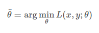
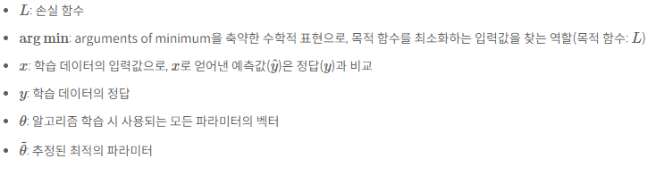
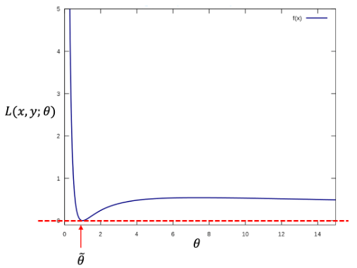

># Loss Function
- 지도학습(Supervised Learning) 시 알고리즘이 예측한 값과 실제 정답의 차이를 비교하기 위한 함수

- 학습 중에 알고리즘이 얼마나 잘못 예측하는 정도'를 확인하기 위한 함수로써 최적화(Optimization)를 위해 최소화하는 것이 목적인 함수

- 손실 함수를 통해 모델 학습 중에 손실(loss)이 커질수록 학습이 잘 안 되고 있다고 해석할 수 있고, 반대로 손실이 작아질수록 학습이 잘 이루어지고 있다고 해석

***

- 수식

