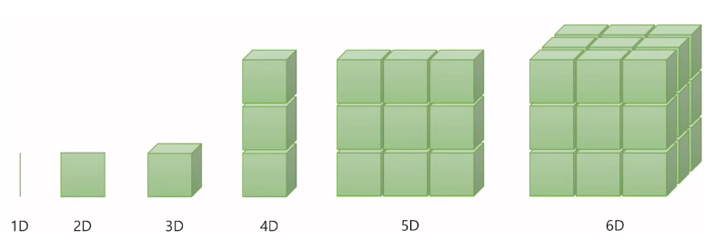
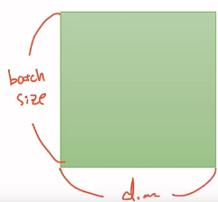
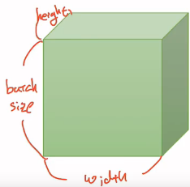

# Pytorch CNN

> ## 텐서 조작하기(Tensor Mainpulation)

### 1. 벡터, 행렬 그리고 텐서

***

- 차원으로 구성된 값을 행렬(Matrix)라고 합니다. 그리고 3차원이 되면 우리는 텐서(Tensor)라고 부릅니다

- ***2D Tensor(Typical Simple Setting)***
    - |t| = (Batch size, dim)
    - 2차원 텐서의 크기 |t|를 (batch size × dimension)으로 표현하였을 경우
        
        
    
    - 3,000개에서 64개씩 꺼내서 처리한다고 한다면 이 때 batch size를 64라고 합니다. 그렇다면 컴퓨터가 한 번에 처리하는 2D 텐서의 크기는 (batch size × dim) = 64 × 256이 됩니다

- ***3D Tensor(Typical Computer Vision) - 비전 분야에서의 3차원 텐서***
    - |t| = (batch size, width, height)
    - 이미지라는 것은 가로, 세로라는 것이 존재합니다. 그리고 여러 장의 이미지, 그러니까 batch size로 구성하게 되면 아래와 같이 3차원의 텐서가 됩니다.
    - batch size, 가로는 너비(width), 그리고 안쪽으로는 높이(height)
        
        

